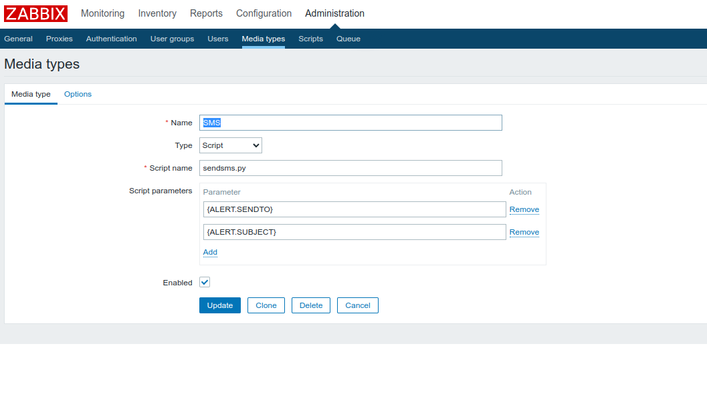
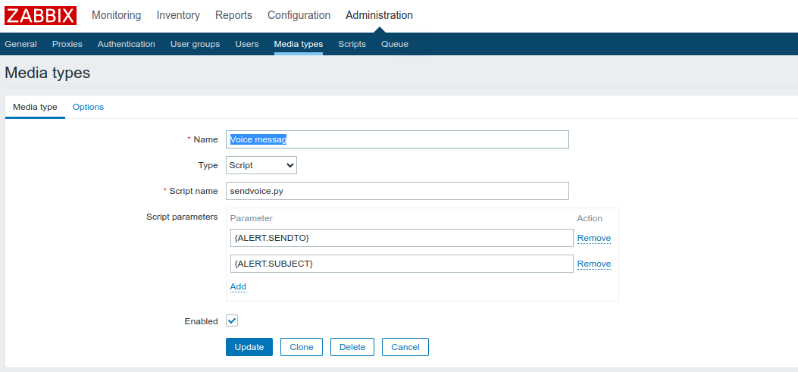

# Integracja VPBX.PL / Callapi.pl z Zabbix

## sendsms.py

Skrypt służy do wysyłania SMS-ów alarmowych z systemu Zabbix.
Do poprawnego działania integracji wymagany jest Python 3 oraz moduły pythona:

```
requests
dateutil
datetime
```

### Instalacja

Plik należy umieścić w katalogu `/usr/lib/zabbix/alertscripts` oraz powinien być wykonywalny:

```
cd /usr/lib/zabbix/alertscripts
wget https://raw.githubusercontent.com/vpbx-pl/examples/integrations/zabbix/sendsms.py
chmod +x sendsms.py
```


### Konfiguracja

Plik należy wyedytować i wpisać nazwę użytkownika i hasło. Można je uzyskać po zalogowaniu się do VPBX.PL w sekcji "Dostęp do API"

```
#API Username
username = ""
#API Password
password = ""
```

W zależności od tego, w jakiej formie zapisane są numery telefonu w systemie Zabbix, należy dostosować 2 parametry:

```
stripPrefix=0
addPrefix=""
```

Na przykład, jeśli numery zapisane są w formacie lokalnym (np 601000000), parametry te powinny mieć wartość:
```
stripPrefix=0
addPrefix="48"
```

Na przykład, jeśli numery zapisane są w formacie +E164 (np +48601000000), parametry te powinny mieć wartość:
```
stripPrefix=1
addPrefix=""
```

### Konfiguracja w Zabbix:

Oto przykład konfiguracj skryptu w Zabbix:




## sendvoice.py


Skrypt sendvoice.py umożliwia wysłanie wiadomości głosowej poprzez system VPBX.PL. 

 # Instalacja

Plik należy umieścić w katalogu `/usr/lib/zabbix/alertscripts` oraz powinien być wykonywalny:

```
cd /usr/lib/zabbix/alertscripts
wget https://raw.githubusercontent.com/vpbx-pl/examples/integrations/zabbix/sendvoice.py
chmod +x sendvoice.py
```

### Konfiguracja

Plik należy wyedytować i wpisać nazwę użytkownika i hasło. Można je uzyskać po zalogowaniu się do VPBX.PL w sekcji "Dostęp do API"

```
#API Username
username = ""
#API Password
password = ""
```

Połączenia głosowe wymagają wpisania parametru `from_number`. Numer ten musi być wykupiony wcześniej w portalu vpbx.pl. Można także używać dowolnego numeru, który został wcześniej poprawnie zweryfikowany.
```
from_number="48220000000"
```


Do generowania TTS, domyślnie używany głos to "pl-PL/Maja". W przypadku gdy alerty wysyłane są w innym języku - na przychład angielskim należy zmienić głos na:

```
voice="en-GB/Brian"
```
Pełna lista dostępnych głosów dostępna jest na stronie: https://callapi.pl/docs/


W zależności od tego, w jakiej formie zapisane są numery telefonu w systemie Zabbix, należy dostosować 2 parametry:

```
stripPrefix=0
addPrefix=""
```

Na przykład, jeśli numery zapisane są w formacie lokalnym (np 601000000), parametry te powinny mieć wartość:
```
stripPrefix=0
addPrefix="48"
```

Na przykład, jeśli numery zapisane są w formacie +E164 (np +48601000000), parametry te powinny mieć wartość:
```
stripPrefix=1
addPrefix=""
```

### Konfiguracja w Zabbix:

Oto przykład konfiguracj skryptu w Zabbix:




## Uwagi

Oba skrypty tworzą plik tymczasowy /tmp/sendsmstoken, w którym przechowywany jest token do późniejszego użycia.
